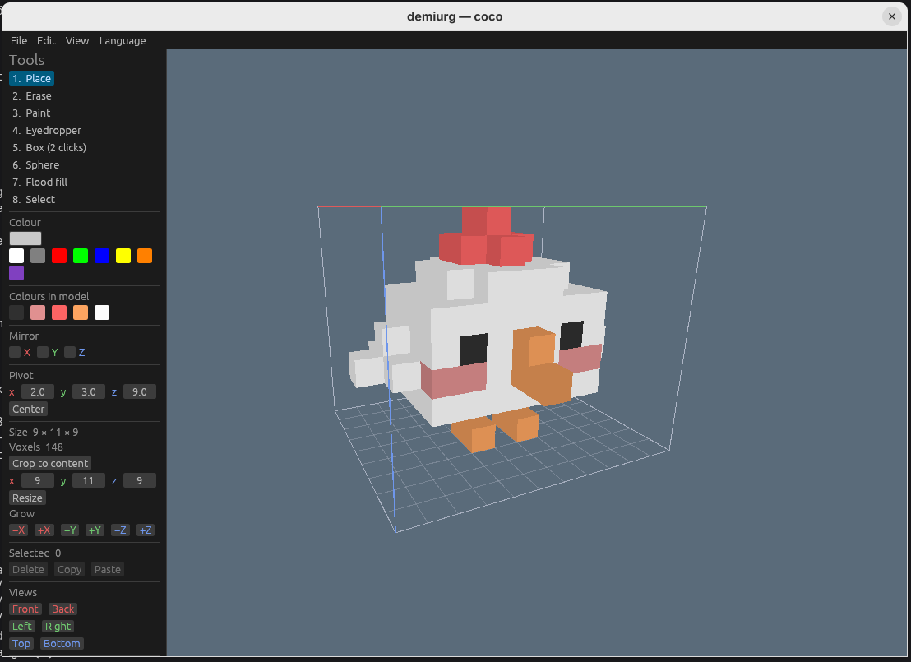

# demiurg

Voxel **asset editor** for the [roxlap](https://github.com/NCrashed/roxlap) voxel
engine and the monada game framework.

Author voxel **models** and preview them **rendered by the actual engine** — the
viewport *is* roxlap, so what you paint is byte-for-byte what the game shows.
Save directly into the engine's formats. Native today; the browser/WASM build is
designed but not yet shipped (one codebase, see [DESIGN.md](./DESIGN.md)).



## Status

**v0.5.0 — model + skeletal-animation editor for artists.** The native model
editor (tools, selection + move, palette, mirror, pivot, resizing, undo/redo,
reference-image tracing, project save and engine-format export) plus a new
**skeletal-animation editor** — rig a model into bones and animate it with
keyframes, posed in the viewport and exported to `.rkc` (DESIGN.md M2 + M4).

Animation is a **preview**: the `.rkc` format and the rig UI may still change.
See [Skeletal animation](#skeletal-animation-preview) below. Voxel-video
(`.vvid`, M5) follows. See the [CHANGELOG](./CHANGELOG.md).

## Install

Pre-built **Windows** binaries are attached to each
[release](https://github.com/NCrashed/demiurg/releases). Download
`demiurg-<version>-windows-x64.exe` and run it.

## Build from source

The toolchain is pinned in `rust-toolchain.toml` (a nightly shared with roxlap
for the future wasm-threads path; native builds behave like stable).

With [Nix](https://nixos.org) (provides the toolchain and the Linux render libs):

```sh
nix develop --command cargo run -p demiurg-app -- model.kv6
```

Or with a matching rustup toolchain (rustup auto-installs the pinned nightly):

```sh
cargo run -p demiurg-app -- model.kv6      # or no path for a blank canvas
```

On Linux the viewport needs the usual windowing/render libs (`libxkbcommon`,
`wayland`, X11, `vulkan-loader`); the Nix devshell supplies them.

## Usage

```
demiurg [path.kv6 | path.vox | path.demiurg | path.rkc]    # no path -> a blank canvas
```

- **Tools** `1`–`8`: place, erase, paint, eyedropper, box, sphere, flood fill,
  select. Left mouse applies the tool; `Ctrl`+click eyedrops a colour.
- **Select** (`8`): click or drag a marquee; `Shift` adds, `Alt` removes. Drag a
  selected voxel's face to move the selection; `Delete`, `Ctrl+C`/`Ctrl+V`
  copy/paste, `Esc` deselects.
- **Camera**: right-drag orbits, middle-drag (or `Shift`+right) pans, wheel /
  `W`/`S` zoom, `Home` recenters; the **Views** panel and numpad `1`/`3`/`7`
  snap to axis views (`Ctrl` for the opposite face).
- **Edit**: `Ctrl+Z` undo, `Ctrl+Y` / `Ctrl+Shift+Z` redo.
- **Reference image**: File ▸ Open reference image, or drag a PNG/BMP/JPG/GIF/
  TGA/WEBP onto the window — pixel art becomes a flat 1-voxel-thick guide to
  trace from (non-destructive; place/flip/hide it in the Reference panel).
  Dropping a `.kv6`/`.vox`/`.demiurg` opens it as the model (and a `.rkc` as a
  rig).
- **Render**: CPU renderer by default (reliable everywhere); `--gpu` (or
  `ROXLAP_GPU=1`) opts into the faster GPU backend, whose device creation can
  hang on some Windows GPUs/drivers (white frozen window). Switch sprite/voxel
  preview in the View menu.
- **Open / recent**: File ▸ Open loads any `.demiurg` / `.rkc` / `.kv6` / `.vox`;
  File ▸ Open recent reopens a recently used file, and the file dialog remembers
  the last folder you used.
- **Language**: `DEMIURG_LANG=ru`, or the Language menu (English / Русский).

### Skeletal animation (preview)

New in v0.5.0, and still a preview — the formats and UI may change. You build a
**rigged character** (a skeleton of bones, each carrying its own voxel mesh),
pose it across keyframes, and export to roxlap's `.rkc` format.

- **Start a rig**: File ▸ New rig (one root bone) or Convert to rig (wrap the
  current model as a one-bone rig). Opening a `.rkc` continues editing one.
- **Rig sub-modes** (Rig panel): **Sculpt** edits the active bone's mesh with the
  normal voxel tools; **Skeleton** sets each bone's joint, parent and rotation
  axis (drag a bone in the viewport to position it); **Animate** previews and
  poses the clip.
- **Posing** (Animate mode): click a bone to select it, then left-drag in the
  viewport to transform it on the selected keyframe. `R` / `G` / `S` switch the
  gizmo between **rotate** (trackball / ring), **move** and **scale**.
- **Timeline** (bottom bar): `Space` plays / pauses; `,` and `.` step to the
  previous / next keyframe; buttons add, delete, copy, cut and paste keyframes;
  drag a tick to retime it.
- **Clips** (left panel): add, rename and delete animation clips, and set each
  clip's length and whether it loops.
- **Export**: File ▸ Export character writes a `.rkc`; a `.demiurg` project also
  stores the full rig.

## Layout

```
demiurg-core    document model, edit commands, undo/redo, format conversion (no UI)
demiurg-i18n    UI message catalogue + translations (no_std, no deps)
demiurg-view    viewport: roxlap SceneRenderer bridge, orbit camera, picking
demiurg-app     native binary (winit + egui over the roxlap framebuffer)
```

## Formats

- `.demiurg` — lossless editor project (the source of truth; stores a plain
  model or a full rig).
- `.kv6` — engine sprite export (surface voxels; how monada draws pieces).
- `.rkc` — rigged-character export (skeleton + per-bone meshes + animation
  clips; roxlap's animated-character container). *Preview — see above.*
- `.vxl` — voxlap world export.
- `.vox` — MagicaVoxel import/export (single model; no pivot, so import
  centres it).

## Dependencies

roxlap only — `roxlap-formats`, `roxlap-render`, `roxlap-scene`, `roxlap-core`
(crates.io 0.13.0). No monada dependency. See [DESIGN.md](./DESIGN.md) for the
architecture and roadmap.

## License

MIT OR Apache-2.0
